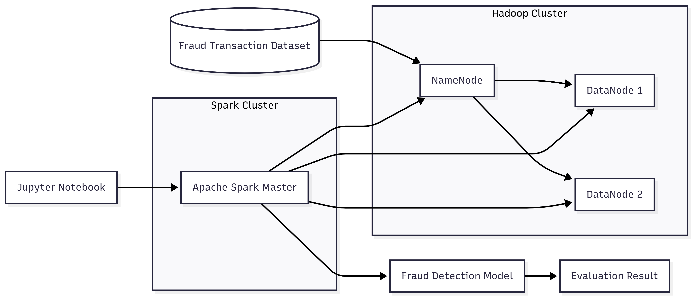

# Proyek Akhir Mata Kuliah Big Data: Fraud Detection Menggunakan Hadoop dan Apache Spark

## Business Understanding

Fraud atau transaksi penipuan merupakan salah satu permasalahan utama dalam industri keuangan. Transaksi fraud dapat menyebabkan kerugian finansial yang signifikan bagi perusahaan maupun pelanggan. Tantangan utama dalam mendeteksi fraud adalah jumlah transaksi fraud yang sangat sedikit dibandingkan transaksi normal, sehingga menyebabkan ketidakseimbangan data (imbalanced dataset).

Pada proyek ini dikembangkan sebuah pipeline analisis big data untuk mendeteksi transaksi fraud menggunakan teknologi Hadoop HDFS dan Apache Spark. Selain melakukan klasifikasi transaksi, proyek ini juga bertujuan membangun arsitektur pemrosesan data yang scalable sehingga mampu menangani data dalam jumlah besar.

---

## Permasalahan Bisnis

Permasalahan yang ingin diselesaikan dalam proyek ini meliputi:

1. Sulitnya mendeteksi transaksi fraud karena jumlah kasus fraud sangat sedikit dibandingkan transaksi normal.
2. Belum diketahui karakteristik transaksi yang memiliki kecenderungan fraud.
3. Diperlukan metode klasifikasi yang mampu mengidentifikasi transaksi fraud secara efektif.
4. Diperlukan arsitektur pemrosesan data yang scalable untuk mendukung analisis data dalam skala besar.

---

## Cakupan Proyek

Cakupan pekerjaan dalam proyek ini meliputi:

* Exploratory Data Analysis (EDA).
* Analisis distribusi transaksi fraud dan non-fraud.
* Analisis karakteristik transaksi berdasarkan nilai transaksi (amount).
* Data preprocessing dan feature engineering.
* Penanganan ketidakseimbangan data (imbalanced data).
* Pembangunan model klasifikasi fraud.
* Evaluasi performa model.
* Implementasi arsitektur big data menggunakan Hadoop HDFS dan Apache Spark.

---

## Dataset

Dataset yang digunakan merupakan dataset transaksi keuangan yang berisi informasi terkait aktivitas transaksi pelanggan.

Beberapa fitur yang digunakan antara lain:

* Transaction Amount (`amt`)
* Merchant
* Transaction Category
* Customer Location
* Customer Occupation
* Transaction Timestamp
* Merchant Location

Target yang diprediksi:

* `is_fraud`

  * 0 = Non-Fraud
  * 1 = Fraud

### Karakteristik Dataset

| Keterangan       | Jumlah    |
| ---------------- | --------- |
| Total Transaksi  | 1.296.675 |
| Non-Fraud        | 1.289.169 |
| Fraud            | 7.506     |
| Persentase Fraud | 0,58%     |

Dataset memiliki distribusi kelas yang sangat tidak seimbang sehingga memerlukan penanganan khusus pada tahap pemodelan.

---

## Arsitektur Sistem

Proyek ini menggunakan pendekatan containerization dengan Docker untuk mensimulasikan lingkungan distributed system.

### Komponen Sistem

| Komponen         | Fungsi                               |
| ---------------- | ------------------------------------ |
| NameNode         | Mengelola metadata HDFS              |
| DataNode 1       | Menyimpan blok data HDFS             |
| DataNode 2       | Menyimpan blok data HDFS             |
| Spark Master     | Mengelola proses komputasi Spark     |
| Jupyter Notebook | Lingkungan pengembangan dan analisis |

### Alur Sistem

```text
Dataset Transaksi
        │
        ▼
 Hadoop HDFS
(NameNode + DataNodes)
        │
        ▼
 Apache Spark
(Distributed Processing)
        │
        ▼
Data Preprocessing
        │
        ▼
Fraud Classification Model
        │
        ▼
Model Evaluation
```





---

## Persiapan

### Setup Environment

1. Clone repository

```bash
git clone https://github.com/gesang-aja/Pipeline-Batch-Processing-Hadoop-Spark-Credit-Card-Transactions.git
cd fraud-detection-big-data
```

2. Jalankan seluruh service

```bash
docker compose up -d
```

3. Pastikan service berjalan

```bash
docker ps
```

4. Akses layanan

| Service            | URL                   |
| ------------------ | --------------------- |
| Jupyter Notebook   | http://localhost:8888 |
| Hadoop NameNode UI | http://localhost:9870 |
| Spark UI           | http://localhost:8080 |

---

## Exploratory Data Analysis

### Distribusi Fraud

Hasil analisis menunjukkan bahwa dataset memiliki ketidakseimbangan kelas yang sangat tinggi.

* Non-Fraud : 99,42%
* Fraud : 0,58%

Kondisi ini menyebabkan model berpotensi bias terhadap kelas mayoritas sehingga diperlukan teknik penanganan imbalance.

### Analisis Nilai Transaksi

Nilai transaksi dikelompokkan menjadi tiga kategori:

* Low
* Medium
* High

Hasil analisis menunjukkan bahwa transaksi fraud lebih banyak ditemukan pada kelompok transaksi bernilai tinggi dibandingkan kelompok lainnya. Hal ini menunjukkan bahwa fitur amount memiliki kontribusi penting dalam mendeteksi fraud.

---

## Data Preprocessing

Tahapan preprocessing yang dilakukan meliputi:

* Data Cleaning
* Feature Selection
* Encoding Variabel Kategorikal
* Feature Engineering
* Train-Test Split
* Handling Imbalanced Data

Penanganan data tidak seimbang dilakukan untuk meningkatkan kemampuan model dalam mendeteksi transaksi fraud.

---

## Pemodelan

Model machine learning digunakan untuk mengklasifikasikan transaksi ke dalam dua kategori:

* Fraud
* Non-Fraud

### Alur Pemodelan

```text
Raw Data
    │
    ▼
Preprocessing
    │
    ▼
Handling Imbalance
    │
    ▼
Model Training
    │
    ▼
Prediction
    │
    ▼
Evaluation
```

---

## Evaluasi Model

Karena dataset bersifat imbalanced, evaluasi model difokuskan pada kelas fraud dengan metric:

* Precision
* Recall
* F1-Score

Accuracy tidak digunakan sebagai metrik utama karena dapat memberikan hasil yang menyesatkan pada data dengan distribusi kelas yang tidak seimbang.

### Hasil Evaluasi

| Metrik    | Nilai |
| --------- | ----- | 
| Precision | 0.54  |
| Recall    | 0.57  |
| F1-Score  | 0.56  |


---

## Insight Utama

Berdasarkan hasil analisis diperoleh beberapa temuan penting:

1. Dataset memiliki tingkat ketidakseimbangan kelas yang sangat tinggi dengan fraud hanya sebesar 0,58%.
2. Nilai transaksi (`amount`) merupakan salah satu fitur yang memiliki hubungan kuat terhadap kejadian fraud.
3. Transaksi bernilai tinggi memiliki kecenderungan fraud yang lebih besar dibandingkan transaksi bernilai rendah maupun sedang.
4. Penanganan imbalanced data membantu meningkatkan kemampuan model dalam mendeteksi transaksi fraud.
5. Penggunaan Hadoop dan Spark memungkinkan pemrosesan data dilakukan secara lebih scalable.

---

## Struktur Proyek

```text
fraud-detection-big-data/
│
├── notebooks/
├── scripts/
├── architecture/
├── results/
├── docs/
├── docker-compose.yml
├── requirements.txt
└── README.md
```

---

## Kesimpulan

Proyek ini berhasil membangun pipeline fraud detection berbasis teknologi big data menggunakan Hadoop HDFS dan Apache Spark. Hasil analisis menunjukkan bahwa fraud merupakan kasus yang sangat jarang terjadi namun memiliki pola tertentu, terutama pada transaksi dengan nilai tinggi.

Melalui proses preprocessing, penanganan data tidak seimbang, serta pemodelan machine learning, sistem mampu melakukan klasifikasi transaksi fraud dan non-fraud secara lebih efektif. Selain itu, implementasi arsitektur distributed processing memberikan fondasi yang scalable untuk pengolahan data dalam jumlah besar di masa mendatang.

---

## Author

**Gesang Nur Zamroji**
Mahasiswa Sains Data
Universitas Negeri Surabaya
